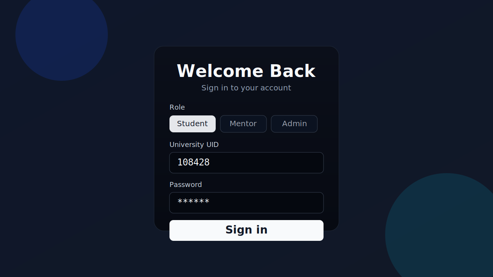
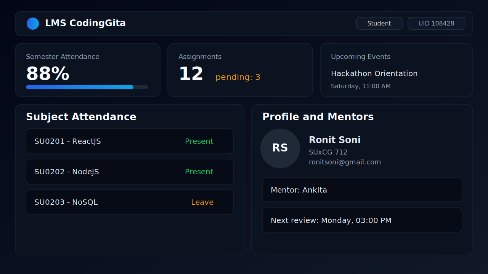

# LMS CodingGita Clone

Production-focused LMS clone inspired by CodingGita, built with a React + Vite frontend and an Express + MongoDB authentication backend.

## Live Demo

- App: `https://lms-codinggita-clone.vercel.app`

## Preview




## Feature Highlights

- Role-based login flow (Student, Mentor, Admin UI roles)
- Student dashboard with attendance, subjects, mentors, assignments, and events
- Attendance views: daily and semester-level
- Assignment tracking and event listing modules
- Profile and feedback pages
- JWT-based authentication backend (`/api/auth`)
- Demo auth fallback for smooth frontend testing when DB is unavailable
- Vercel-ready SPA routing (`vercel.json` rewrite configuration)

## Tech Stack

| Layer | Technologies |
| --- | --- |
| Frontend | React 19, React Router 7, Vite 7, Tailwind CSS 4 |
| Backend | Node.js, Express 5, JWT, bcryptjs |
| Database | MongoDB + Mongoose |
| Tooling | ESLint, npm, Vercel |

## Repository Structure

```text
codingGitaLms_Clone/
|- README.md
`- Lms/
   |- src/                 # Frontend app (pages, components, utilities)
   |- server/              # Express API, models, routes, middleware
   |- public/              # Static assets
   |- docs/images/         # README preview images
   |- .env.example
   |- package.json
   `- vercel.json
```

## Local Setup

1. Clone the repository:

```bash
git clone https://github.com/RonitkumarSoni/LMS-CodingGita-Clone.git
cd LMS-CodingGita-Clone/Lms
```

2. Install dependencies:

```bash
npm install
```

3. Create environment file:

```bash
cp .env.example .env
```

For Windows PowerShell:

```powershell
Copy-Item .env.example .env
```

4. Start frontend and backend in separate terminals:

```bash
# Terminal 1 (Frontend)
npm run dev
```

```bash
# Terminal 2 (Backend API)
npm run server
```

5. Open:

- Frontend: `http://localhost:5173`
- Backend health check: `http://localhost:5000/api/health`

## Environment Variables

Use `.env` in `Lms/`:

| Variable | Required | Description |
| --- | --- | --- |
| `PORT` | No | Backend port (default `5000`) |
| `JWT_SECRET` | Yes | Secret key for signing JWT tokens |
| `MONGODB_URI` | Yes (for DB mode) | MongoDB connection string |
| `ENABLE_DEMO_AUTH` | No | Set `true` to allow demo auth when DB is unavailable |
| `VITE_API_BASE_URL` | No | Frontend API base URL override (default `/api`) |
| `VITE_ENABLE_DEMO_AUTH` | No | Frontend demo fallback toggle (`false` disables it) |

## Demo Credentials

Use these for demo login:

- UID: `108428`
- Password: `123456`
- Role: `Student`

## API Endpoints

Base: `/api/auth`

- `POST /register` - Register user
- `POST /login` - Login with identifier + password + role
- `GET /me` - Fetch current user (requires Bearer token)

## Available Scripts

From `Lms/` directory:

- `npm run dev` - Run Vite frontend
- `npm run dev:server` - Run backend with watch mode
- `npm run server` - Run backend in normal mode
- `npm run build` - Build frontend production bundle
- `npm run preview` - Preview production frontend build
- `npm run lint` - Run ESLint checks

## Deployment Notes

- Frontend is deployed on Vercel.
- `vercel.json` rewrites all routes to `index.html` so direct deep links like `/login` work correctly.
- For production backend APIs, deploy `server/` separately (or via serverless functions) and set `VITE_API_BASE_URL`.

## Status

Actively maintained for LMS feature expansion and production hardening.
